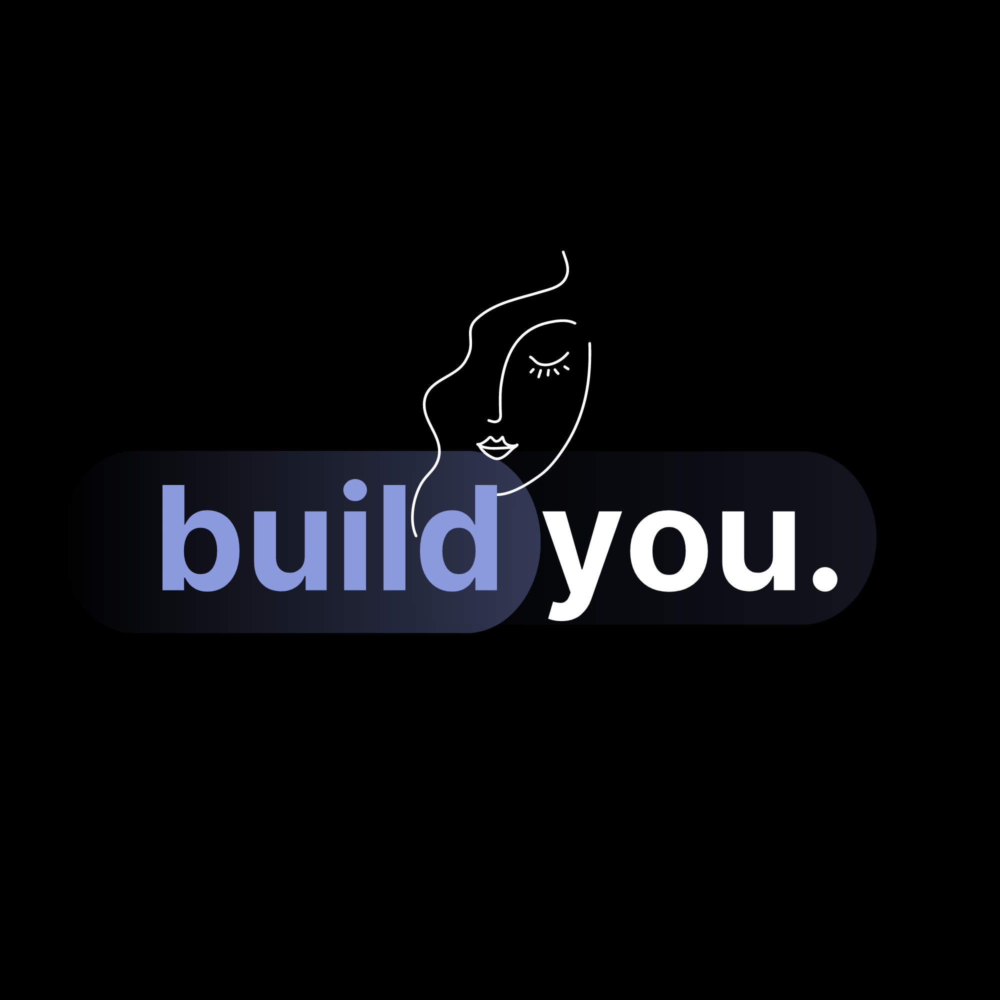

[Devpost Link](https://devpost.com/software/buildyou)

## Inspiration 💡
As the digital world expands, our lives become increasingly intertwined with virtual interactions, and the need to express ourselves as who we want to be has become more crucial than ever. This has created a rift between us and the digital "us", and we often find ourselves searching for ways to represent our emotions, thoughts, and identities.

As it became clearer that we needed a more sincere and immersive way to express ourselves, the idea of **buildyou** became more apparent. Within **buildyou**, our avatars become extensions of our identities and emotions, not just pictures. The project aims to bridge the gap between the complexity of human emotions and the limits of digital media. By allowing users to create avatars that precisely reflect their emotions, **buildyou** revolutionizes how we connect and communicate in the digital age.

## What it does 🛠️

**buildyou** enables artistic expression through avatars in a simple two step approach: profiling and search. First, we allow users to add a quick description about what they want their avatar to look like. Then, we utilize an existing diffusion dataset with images and query for similar results to the user's description using vector embeddings stored in LanceDB. We find the most similar image to return to the user as the user's new avatar. This process is simple, super fast, and easy to use for our users.

## How we built it 🏗️

We first created a seamless and secure user authentication process was a crucial aspect of **buildyou.** To achieve this, we leveraged Descope, a robust authentication platform, that allowed us to easily create an authentication workflow through drag-and-drop. Descope's no-code editor helped us design user-facing screens and authentication flows that perfectly aligned with our project's vision. This page was then embedded into our React website through NextJS.

Next, to retrieve the avatars from the user prompt, we embedded a large dataset of pre-generated images using OpenAI's CLIP model, which played a pivotal role of generating the multi-dimensional vectors to store into LanceDB. This serverless database provided a simple way to add, search, and retrieve all the relevant information, that we previously embedded. The end result is a user-friendly image search feature, where users can create the avatar that they prefer.

Finally, we made use of Armory, a continuous deployment solution, to smoothly launch **buildyou**'s backend. Our deployment approach was strengthened by Armory's dynamic deployment environments, which allowed us to concentrate on staging and production through Kubernetes.

## Challenges we ran into 💪

The main issue was time. We only attended the in-person section of the hackathon, leaving us with only a few hours to try to implement these technologies. Our original goal was to use image generation to create 2D avatars, which could then be converted into flat 3D models for Deep Motion to recognize and animate, but due to time and technological limits, we were forced to pivot. Overall, we did our best to come smoothly to an end, where we have a fully-functional project.

## What's next for buildyou. 🚀

There is undoubtedly a lot of opportunity for improvement in **buildyou**. Creating a large dataset with various generated avatars would be a crucial step forward in improving the accuracy of retrieval and querying. Furthermore, we remain committed to pursuing our original goal of bringing your imagined avatars to life. With the rise newer and improved technological advancements, **buildyou**'s future is one of constant development.

---

## Deploying on Armory

Run docker container with Kubernetes enabled, and then run the following commands:

```bash
armory login
armory agent create
armory deploy start  -f armoryDeployment.yaml -c <Client ID> -s <Client Secret>
```
